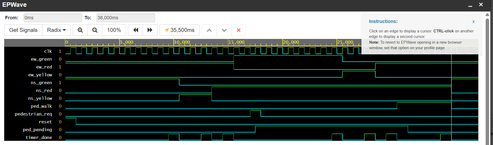

# Verilog Traffic Light Controller

A traffic light controller designed using **Verilog HDL** and implemented as a **Moore Finite State Machine (FSM)**.

## Overview

The controller manages traffic signals for two directions:

- North-South (NS)
- East-West (EW)

It also supports a pedestrian crossing request. A pedestrian request is stored and serviced only when the traffic signals reach a safe all-red condition.

## Features

- Moore FSM based design
- North-South and East-West traffic control
- Pedestrian request handling
- Counter-based state timing
- Synchronous state transitions using a clock
- Reset functionality
- Verilog testbench for simulation
- Waveform-based verification using EPWave

## FSM States

| State | Description | Duration |
|---|---|---:|
| NS_GREEN | North-South green | 10 cycles |
| NS_YELLOW | North-South yellow | 3 cycles |
| ALL_RED_1 | Both directions red | 2 cycles |
| PED_WALK_TO_EW | Pedestrian crossing before EW traffic | 5 cycles |
| EW_GREEN | East-West green | 10 cycles |
| EW_YELLOW | East-West yellow | 3 cycles |
| ALL_RED_2 | Both directions red | 2 cycles |
| PED_WALK_TO_NS | Pedestrian crossing before NS traffic | 5 cycles |

## Design Architecture

The design consists of:

1. **FSM State Register**  
   Stores the current state of the controller.

2. **Next-State Logic**  
   Determines the next state based on the current state, timer completion, and pedestrian request.

3. **Counter**  
   Counts clock cycles for each state.

4. **Pedestrian Request Register**  
   Stores a pedestrian request until it can be safely serviced.

5. **Output Logic**  
   Generates the traffic light and pedestrian signals based on the current FSM state.

## Pedestrian Request

A pedestrian request received during a traffic-light state is stored in `ped_pending`.

The request does not immediately interrupt the current traffic state.

For example:

```text
EW_GREEN
   ↓
EW_YELLOW
   ↓
ALL_RED_2
   ↓
PED_WALK_TO_NS
   ↓
NS_GREEN
```
## Simulation

The design was simulated using Icarus Verilog on EDA Playground.

The waveform below shows the FSM transitions, counter operation, pedestrian request handling, and pedestrian walk signal.


